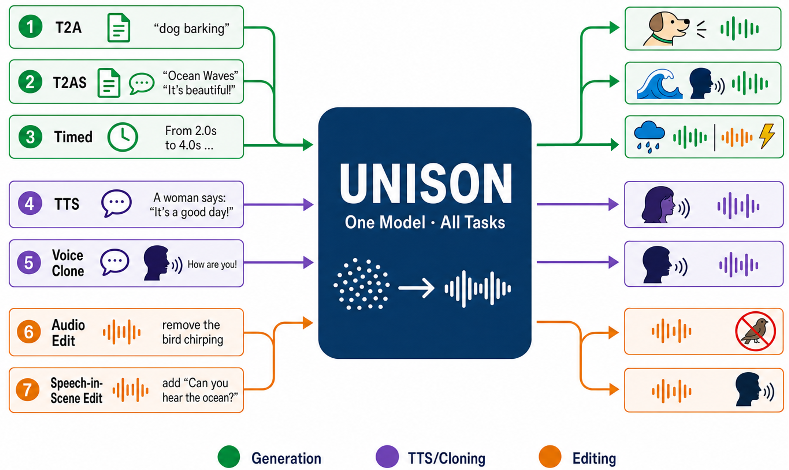

# UNISON

**UNISON** is a unified latent flow-matching framework for speech generation, sound generation, and audio-scene/speech-in-scene editing — all within a single model and a single set of weights.

[](https://arxiv.org/abs/2605.31530)
[](https://github.com/lizhaoqing/UNISON)
[](https://lizhaoqing.github.io/UNISON-demo/)
[](https://huggingface.co/jac22/UNISON)
[-blue.svg)](LICENSE)



---

## Features

A single checkpoint handles all tasks:


| Task                                             | Prompt format                                                                                    |
| ------------------------------------------------ | ------------------------------------------------------------------------------------------------ |
| Text-to-Audio (T2A)                              | `[Audio] {caption}`                                                                              |
| Text-to-Speech (TTS)                             | `[Speech] A {female/male} voice saying "{text}"`                                                 |
| Mixed Speech + Sound                             | `[Speech] A {gender} voice saying "{text}" [Audio] {background}`                                 |
| Zero-shot Speaker Cloning                        | `[Speech with voice] {ref_text}, {target_text}` (built internally from `zeroshotts_config.json`) |
| Audio Scene Editing (add/remove/replace/denoise) | `[Edit] [Audio/Speech] {instruction}`                                                            |
| Timed Temporal Composition                       | `[Audio] From {t1}s to {t2}s, {event}. From {t2}s to {t3}s, {event}. ...`                        |


Task identity is encoded via a **mask channel**; source/reference audio is injected through **VAE-encoded channel concatenation** — no separate encoders needed.

---

## Model variants


| Variant   | DiT depth                   | VAE            | Channels | Config                            |
| --------- | --------------------------- | -------------- | -------- | --------------------------------- |
| **D20S0** | 20 double + 0 single blocks | MMAudio 44 kHz | 40       | `unison/config/D20S0_O_40ch.yaml` |
| **D24S0** | 24 double + 0 single blocks | MMAudio 16 kHz | 20       | `unison/config/D24S0_O_20ch.yaml` |


Both variants share the same Qwen2.5-Omni-7B text encoder and the same inference pipeline.

---

## Project structure

```
UNISON/
├── unison/
│   ├── pipelines/
│   │   ├── infer.py               # Inference pipeline (all tasks)
│   │   └── train.py               # Fine-tuning pipeline
│   ├── models/
│   │   ├── transformers/          # UnisonBackbone — MM-DiT with Omni fusion
│   │   ├── text_encoders/         # Qwen2.5-Omni layer-wise feature extractor
│   │   └── mmaudio/               # MMAudio VAE (16 kHz and 44 kHz)
│   └── config/
│       ├── D20S0_O_40ch.yaml      # Default model config
│       └── D24S0_O_20ch.yaml      # 16 kHz variant config
├── data/
│   ├── train/
│   │   ├── audio/                 # Example audio clips for fine-tuning
│   │   └── metadata.jsonl         # Example fine-tuning metadata
│   └── infer/
│       ├── edit/                  # Source audio for editing / denoising demos
│       └── zeroshotts/            # Reference speech for zero-shot TTS demos
└── scripts/
    ├── infer.sh                   # Inference launcher
    ├── train.sh                   # Fine-tuning launcher
    └── example_infer_prompts/
        ├── gen_prompts.txt        # T2A / TTS / mixed / timed prompts
        ├── edit_config.json       # Editing task configs (source audio + prompt)
        └── zeroshotts_config.json # Zero-shot TTS configs (ref audio + target text)
```

---

## Requirements

- Linux, NVIDIA GPU (≥ 24 GB for inference; 8× recommended for training)
- Python ≥ 3.10
- CUDA ≥ 11.8

```bash
pip install -r requirements.txt
```

`flash-attn` is optional but strongly recommended. Without it the model automatically falls back to PyTorch SDPA (slower, higher memory usage). Install separately to match your CUDA/PyTorch version:

```bash
# Build from source (~10 min):
pip install flash-attn --no-build-isolation

# Or use a prebuilt wheel from:
# https://github.com/Dao-AILab/flash-attention/releases
```

---

## Setup

### 1. MMAudio VAE weights

Download from the [MMAudio](https://github.com/hkchengrex/MMAudio) release and place at:

```
unison/models/mmaudio/data/ext_weights/
    v1-44.pth       # 44 kHz VAE  (for D20S0)
    v1-16.pth       # 16 kHz VAE  (for D24S0)
    best_netG.pt    # BigVGAN vocoder  (for 16 kHz VAE only)
```

### 2. Qwen2.5-Omni-7B

```bash
# From HuggingFace Hub:
export QWEN_OMNI_MODEL_PATH=Qwen/Qwen2.5-Omni-7B
# Or point to a local download:
export QWEN_OMNI_MODEL_PATH=/path/to/Qwen2.5-Omni-7B
```

### 3. UNISON checkpoint

Download from HuggingFace: **[huggingface.co/jac22/UNISON](https://huggingface.co/jac22/UNISON)**

Place the checkpoints under `checkpoints/`:

```
checkpoints/
    unison_D20S0_O_40ch/model.safetensors   # 44 kHz
    unison_D24S0_O_20ch/model.safetensors   # 16 kHz
```

`--model_ckpt` accepts a **directory** (auto-detects `ema_model.pt` → `model.safetensors` → `pytorch_model.bin` in that order) or a **direct file path** to any of the three formats. EMA wrappers are unwrapped automatically.

---

## Inference

### Quick start

`--checkpoint_dir` accepts a **directory** (auto-detects `ema_model.pt` → `model.safetensors` → `pytorch_model.bin`) or a **direct file path**. EMA wrappers are unwrapped automatically.

```bash
cd UNISON
export QWEN_OMNI_MODEL_PATH=/path/to/Qwen2.5-Omni-7B

# Run all tasks (generation + editing + zero-shot TTS) — D20S0, 44 kHz:
bash scripts/infer.sh \
    --checkpoint_dir checkpoints/unison_D20S0_O_40ch \
    --model_config   unison/config/D20S0_O_40ch.yaml \
    --vae_config     unison/models/mmaudio/vae_config_44k.yaml \
    --task_mode      all

# D24S0, 16 kHz variant:
bash scripts/infer.sh \
    --checkpoint_dir checkpoints/unison_D24S0_O_20ch \
    --model_config   unison/config/D24S0_O_20ch.yaml \
    --vae_config     unison/models/mmaudio/vae_config_16k.yaml \
    --task_mode      all
```

Outputs are written to `<checkpoint_dir>/infer_<steps>steps/<ckpt_name>/`.

### Task modes

Pass `--task_mode <mode>` to run a specific task:


| Mode         | Description                                     |
| ------------ | ----------------------------------------------- |
| `generation` | T2A, TTS, mixed speech+audio, timed composition |
| `editing`    | Audio/speech scene editing and denoising        |
| `zeroshotts` | Zero-shot speaker cloning                       |
| `all`        | All three modes in sequence (default)           |


### Key parameters

All parameters can be passed as `--key value` arguments or set as environment variables:


| Argument                | Default | Description                                    |
| ----------------------- | ------- | ---------------------------------------------- |
| `--num_inference_steps` | 100     | ODE steps (50 for fast, 100 for paper quality) |
| `--guidance_scale`      | 4.5     | CFG scale                                      |
| `--seed`                | 42      | Random seed                                    |
| `--gen_duration`        | 10.0    | Output length in seconds for generation        |
| `--ref_duration`        | 3.0     | Reference clip length for zero-shot TTS        |


See `scripts/infer.sh` for the full list and inline documentation.

### Example configs

Edit these files before running:

- `**scripts/example_infer_prompts/gen_prompts.txt**` — one prompt per line for T2A, TTS, mixed, and timed tasks
- `**scripts/example_infer_prompts/edit_config.json**` — list of editing tasks, each with a `prompt` and `source_audio` path
- `**scripts/example_infer_prompts/zeroshotts_config.json**` — list of zero-shot TTS tasks, each with `target_text` and `ref_audio` path

The `data/infer/` directory ships with the demo audio samples ready to use.

### Single-prompt inference

```bash
python unison/pipelines/infer.py \
  --model_ckpt  checkpoints/unison_D20S0_O_40ch \
  --model_config unison/config/D20S0_O_40ch.yaml \
  --vae_config   unison/models/mmaudio/vae_config_44k.yaml \
  --omni_model_path $QWEN_OMNI_MODEL_PATH \
  --task_mode   generation \
  --gen_prompt  "[Audio] Rain falling on a tin roof with distant thunder" \
  --gen_duration 10.0 \
  --output_dir  outputs/demo
```

---

## Fine-tuning

### Quick start (single GPU, bundled data)

```bash
export QWEN_OMNI_MODEL_PATH=/path/to/Qwen2.5-Omni-7B
bash scripts/train.sh --num_processes 1
```

This runs 200 steps on the 5 bundled WavCaps clips (`data/train/metadata.jsonl`) and saves outputs to `outputs/unison_finetune/`.

### Fine-tune on your own data

```bash
bash scripts/train.sh \
    --num_processes         8 \
    --batch_size            8 \
    --metadata              /path/to/my_metadata.jsonl \
    --pretrained_model_path checkpoints/unison_D20S0_O_40ch \
    --max_train_steps       50000 \
    --exp_name              my_run
```

### Key arguments


| Argument                  | Default                     | Description                                                                                                |
| ------------------------- | --------------------------- | ---------------------------------------------------------------------------------------------------------- |
| `--num_processes`         | 1                           | Number of GPUs                                                                                             |
| `--batch_size`            | 2                           | Per-GPU batch size                                                                                         |
| `--max_train_steps`       | 200                         | Total training steps                                                                                       |
| `--lr`                    | 1e-5                        | Learning rate                                                                                              |
| `--metadata`              | `data/train/metadata.jsonl` | Training data JSONL                                                                                        |
| `--pretrained_model_path` | —                           | Starting checkpoint (directory or file; supports `ema_model.pt`, `model.safetensors`, `pytorch_model.bin`) |
| `--model_config`          | `D20S0_O_40ch.yaml`         | DiT model config                                                                                           |
| `--vae_config`            | `vae_config_44k.yaml`       | VAE config                                                                                                 |
| `--exp_name`              | `unison_finetune`           | Experiment name; outputs saved to `outputs/<exp_name>/`                                                    |
| `--checkpointing_steps`   | 100                         | Save checkpoint every N steps                                                                              |
| `--logging_steps`         | 10                          | Log loss / lr / grad_norm every N steps                                                                    |
| `--report_to`             | `tensorboard`               | Tracker backend (`tensorboard` | `wandb` | `none`)                                                         |


### Metadata format

One JSON object per line with at least:

```json
{"audio_path": "data/train/audio/example.wav", "caption": "A dog barks twice.", "duration": 4.2}
```

See `data/train/metadata.jsonl` for a complete example.

### Outputs

Each run writes to `outputs/<exp_name>/`:

- `checkpoint-<step>/` — model + optimizer state (resume with `--resume_from_checkpoint latest`)
- `training_config.json` — all args and model config saved at run start
- `rank_0.log` — full training log (loss, lr, grad norm per `--logging_steps` steps)

---

## Citation

```bibtex
@article{li2026unison,
  title   = {UNISON: A Unified Sound Generation and Editing Framework via Deep LLM Fusion},
  author  = {Li, Zhaoqing and Xu, Haoning and Su, Jingran and Liu, Yaofang and Rao, Zhefan and
             Wang, Huimeng and Deng, Jiajun and Wang, Tianzi and Jin, Zengrui and Liu, Rui and
             Che, Haoxuan and Liu, Xunying},
  journal = {arXiv preprint arXiv:2605.31530},
  year    = {2026}
}
```

---

## Acknowledgements

We thank the authors of the following works for their excellent open-source contributions, which form the foundation of UNISON:

- [HunyuanVideo](https://github.com/Tencent-Hunyuan/HunyuanVideo-1.5) — MM-DiT backbone architecture
- [MMAudio](https://github.com/hkchengrex/MMAudio) — audio VAE and feature utilities
- [Qwen2.5-Omni](https://huggingface.co/Qwen/Qwen2.5-Omni-7B) — text/audio LLM used for deep conditioning
- [Ovi](https://github.com/character-ai/Ovi) (Character.AI) — inspiring cross-modal fusion design for joint audio-video generation

## License

This project is released under the **Apache 2.0 License** with additional non-commercial use restrictions inherited from upstream dependencies. Specifically:

- The backbone architecture derives from [HunyuanVideo](https://github.com/Tencent-Hunyuan/HunyuanVideo/blob/main/LICENSE), which prohibits commercial use without a separate license from Tencent.
- The text/audio conditioning uses [Qwen2.5-Omni](https://huggingface.co/Qwen/Qwen2.5-Omni-7B/blob/main/LICENSE), subject to its own license terms.

**This software is intended for research and non-commercial use only.** See [LICENSE](./LICENSE) for the full terms.